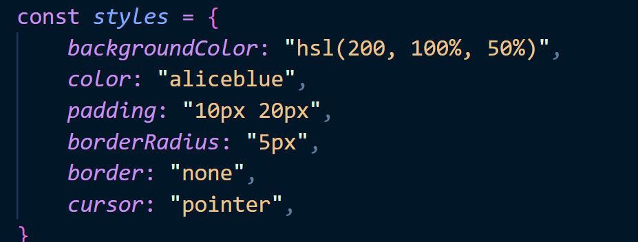
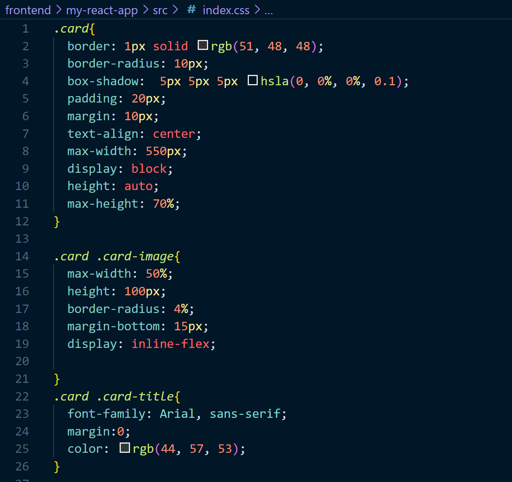
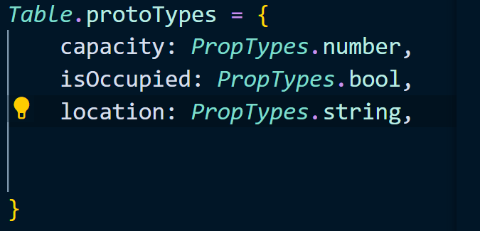
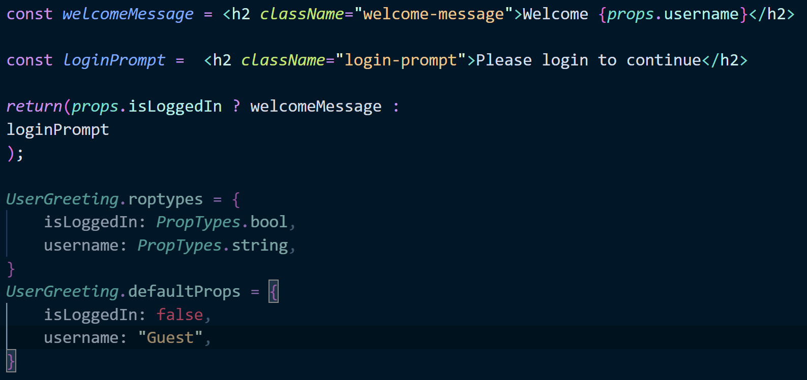
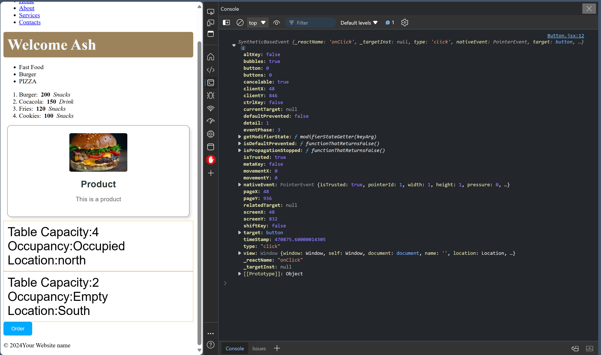

# React + Vite

This template provides a minimal setup to get React working in Vite with HMR and some ESLint rules.

Currently, two official plugins are available:

- [@vitejs/plugin-react](https://github.com/vitejs/vite-plugin-react/blob/main/packages/plugin-react/README.md) uses [Babel](https://babeljs.io/) for Fast Refresh
- [@vitejs/plugin-react-swc](https://github.com/vitejs/vite-plugin-react-swc) uses [SWC](https://swc.rs/) for Fast Refresh


# Notes

**#Day2**
- CSS can be used inline, externally or through modules. Using inlline is like:

We use inline CSS for simple projects. Which donot need reuse. For complex component it becomes tedious.
- Through external css like:

It is also used for simple components.
- And through creating modules, for which we typically create separate folder for the **<component>.jsx** file and include its css file there.<br>
It is used for complex component and it can be more time consuming. But if we manage it can be helpful.

**#Day3**
- props 
 - read-only properties that are shared between component
 - A parent component can send data to a child component
 - ```<component key=value/>```
 - Used the ```**prop**``` in ```Table.jsx```. Create a child component Table in App.jsx.

-propTypes
 - a mechanism that ensures that passed value is of correct datatype
 - ```capacity: PropTypes.number```
 

- defaultProps
  - default values for props in case they are not passed from the parent component 
  - capacity: 0


- conditional rendering
  - allows you to control what gets rendered in your application based on certain conditions (show, hide, or change components)
  


#Day4
- rendering list
  - rendering list involves using list name and ```map``` function to map the list item onto to frontend, using a key value unique for each item.

#Day5
- onclick events
  - an interaction when a user clicks on a specific element
  - we can respond to clicks by passing a callback to onClick event handler
  - ```const handleClick = () => console.log("Order Placed");``` creates a order placed output in console.
  - event parameter is used to git output of event that happenned.
  
  - we can also use onDoubleClick event handler to handle double click i.e the query runs on double click
  - we can use onClick event handler with buttons images

  #Day6
  - React hook
    - a special function that allows functional component to use React features without writing class components
    - useState, useEffect, useContext, useReducer, useCallback,etc
  
  - useState()
    - a react hook that allows the creation of a stateful variable and a setter function to update its value in the virtual DOM [name, setName]

  
  #Day7
  - onChange event handler
    - event handler primarily with form elements
    e.g ```<input>, <select>,<radio>```
    - triggers a function everytime the value of input changes